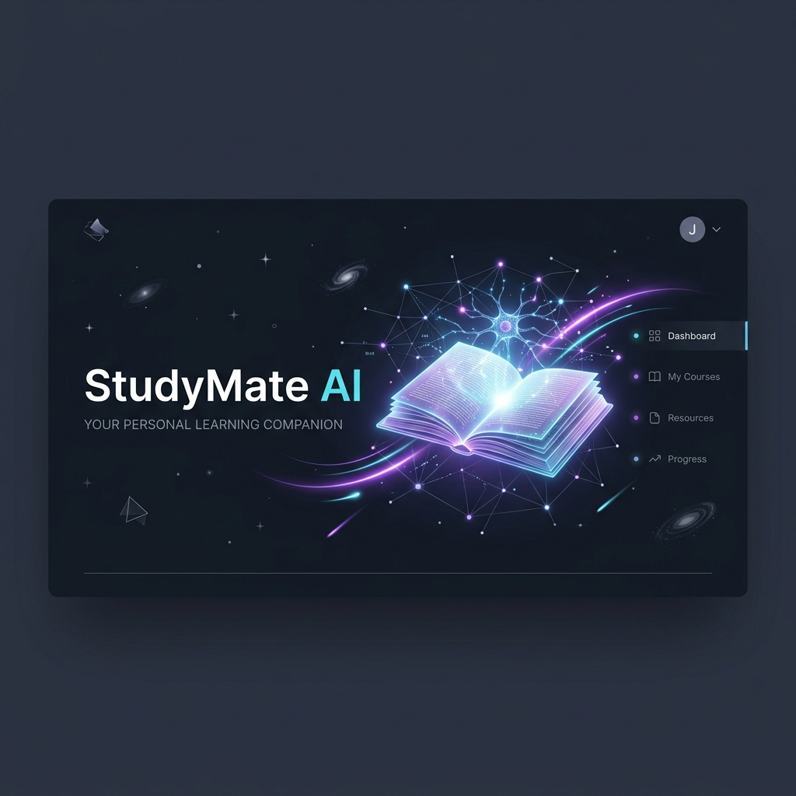
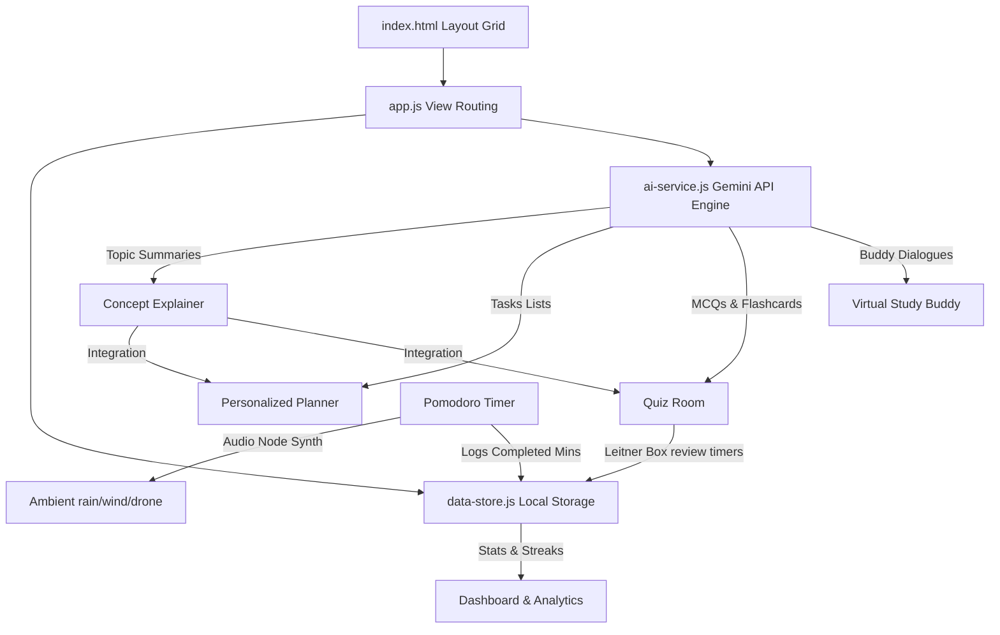

# StudyMate AI – Your Intelligent Study Coach



StudyMate AI is a premium, client-side single-page web application designed as a personal, intelligent study coach. It helps students simplify complex topics, generate customized study schedules, test knowledge retention using a Spaced Repetition System (SRS), stay focused using a customizable Pomodoro timer with local ambient synthesizers, and discuss concepts with virtual study buddies.

---

## 🎯 Target Audience
- **School & College Students** trying to organize high-volume course material.
- **Competitive Exam Aspirants** tracking rigorous prep timelines.
- **Self-Learners** seeking structured memory retention templates.

---

## 💡 Problem Statement

Many students face major friction in their self-directed study workflows:
1. **Conceptual Blocks**: Getting stuck on dense, complex academic jargon.
2. **Disorganized Schedules**: Struggling to pace study material over calendar dates.
3. **Inefficient Revision**: Forgetting key concepts shortly after reading (the "Forgetting Curve").
4. **Distraction & Fatigue**: Difficulty sustaining focus during deep work intervals.
5. **Lack of Interactivity**: Reading passively instead of actively recalling facts or discussing them.

---

## ⚙️ How It Works: System Architecture Flow

The application coordinates student inputs, local storage indices, local synthesizer contexts, and Google's Gemini models in a unified client-side flow:



---

## 🚀 Key Features

### 📊 1. Personal Dashboard & Progress Tracking
- Tracks daily study **streaks** with visual flame indicators.
- Displays summary statistics (Total Focus Time, Task Completion Rate, and Quiz Accuracy).
- Renders an interactive **SVG Bar Chart** showing minutes studied over the last 7 days.
- Suggests "Next Study Recommendations" based on planner checklists.

### 💡 2. Concept Explainer & Summarizer
- Input any topic or notes and select your preferred output style:
  - **ELI5** (Explain Like I'm 5): Simple language and child-friendly analogies.
  - **Analogy**: Relatable real-world stories (e.g. comparing Photosynthesis to a kitchen).
  - **Deep-Dive**: Advanced formulas, balanced equations, and detailed structures.
  - **Bullet Summary**: Compact takeaways for high-speed review.
- Direct click-actions to immediately generate a Study Plan or a Quiz from the topic.

### 📅 3. Personalized Study Planner
- Schedules day-by-day checklist targets based on subject, total days, and daily available study hours.
- Saves progress checkmarks globally so tracking active schedules directly scales completion metrics on the dashboard.

### 🧠 4. Interactive Quizzes & Spaced Repetition (SRS)
- **MCQ Quizzes**: Immediate green/red visual response loops with shake indicators on incorrect choices. Completed scores update accuracy averages.
- **SRS Flashcards**: Uses a 3D perspective flip card container. Flashcard boxes are sorted dynamically using a local **Leitner System** ("Easy", "Hard", "Again") to schedule cards back into active queues at delayed intervals.

### ⏱️ 5. Pomodoro Focus Timer with Web Audio Ambience
- Toggles 25-minute study / 5-minute break timers.
- Circular SVG progress ring tracks countdown progress.
- Includes **local Web Audio Synthesizer loops** to generate offline ambient sounds with no external data calls:
  - 🌧️ *Gentle Rainstorm* (White noise passed through low-pass sweep filters).
  - 🎵 *Binaural Focus Drone* (40Hz offset frequencies for alpha-wave concentration).
  - 🌳 *Deep Forest Wind* (Brownian noise loops).

### 💬 6. AI Study Buddy Simulator
- Practice active recall by chatting with virtual peers of differing personas:
  - **Encouraging Emma**: Conversational, highly motivational, utilizes emojis.
  - **Analytical Alex**: Demands definitions, queries constraints, focuses on math/logic.
  - **Skeptical Sam**: Plays devil's advocate, questions generalizations, identifies logical holes.

---

## 🛠️ Technology Stack
- **Structure**: Semantic HTML5
- **Style**: Custom CSS3 (variables, CSS Grid, custom scrollbars, transitions, 3D transform animations)
- **Logic**: Vanilla ES6+ JavaScript
- **State**: `localStorage` Browser Engine
- **Audio**: Web Audio API Sound Synthesis
- **AI Core**: Google Gemini API (`gemini-1.5-flash`) with high-fidelity Mock offline presets

---

## ⚙️ Installation & Local Setup

Since StudyMate AI is fully client-side and requires zero build configurations, you can run it instantly:

1. Clone this repository to your machine.
2. Open a terminal in the folder directory and run a local web server (to avoid local CORS constraints during API fetches):
   ```bash
   python -m http.server 8000
   ```
3. Open your browser and navigate to:
   ```
   https://darshanyalkar.github.io/StudyMate-AI/
   ```

### 🔑 (Optional) Add your Gemini API Key
By default, the application runs in a simulated mode with highly detailed local mock answers for subjects like Physics, Biology, Chemistry, and Python. To unlock real-time custom responses on any arbitrary topic:
1. Go to the **Settings** view in the application.
2. Paste your **Google Gemini API Key** under "Advanced Configuration" and click Save.
